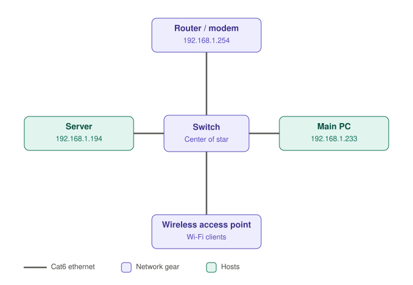
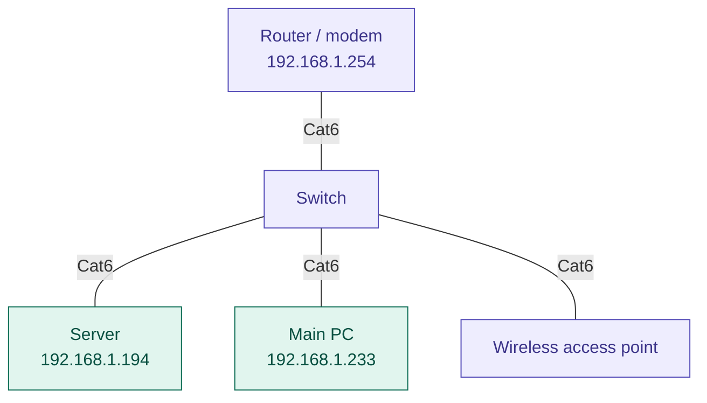

# Network Diagram

Star topology: every device connects to the central switch over Cat6 ethernet.

## Devices

| Device | IP address | Connection |
| --- | --- | --- |
| Router / modem | 192.168.1.254 | Cat6 to switch |
| Server | 192.168.1.194 | Cat6 to switch |
| Main PC | 192.168.1.233 | Cat6 to switch |
| Wireless access point | (not recorded) | Cat6 to switch |

## Editable version (Mermaid)

GitHub renders this block natively, so you can edit it as plain text.

